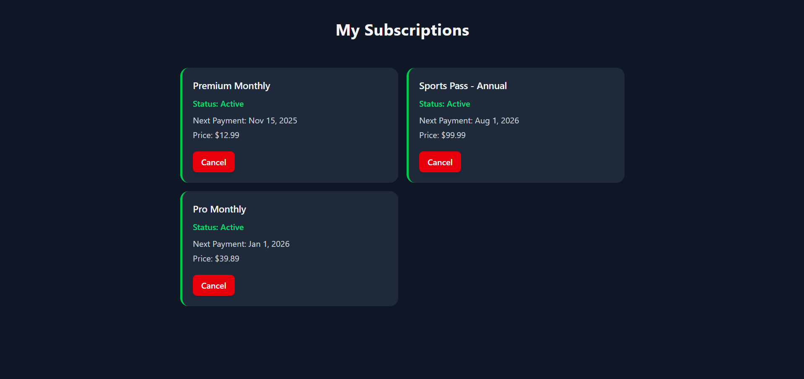
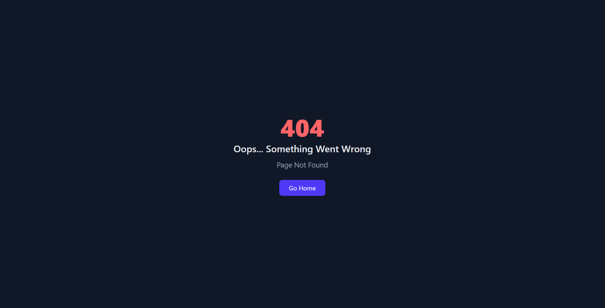

# 💳 Subscription Manager App

A sleek, dark-themed React + TypeScript application for managing user subscriptions.
Built with **Vite, Tailwind CSS, and Tailwind Styled Components**, this app combines clean design, smooth performance, and great developer experience.

---

## 🚀 Tech Stack

- React 19 + TypeScript — Modern component-based UI
- Vite — Ultra-fast dev environment
- Tailwind CSS — Utility-first styling
- Tailwind Styled Components — Reusable styled components
- React Router DOM v7 — Smooth navigation and route handling
---

## ✨🚀 Features

- 📦 Fetches and displays mock subscription data
- 💡 Supports subscription cancellation with instant UI updates
- ⚙️ Error handling and loading states for a realistic experience
- 🧭 React Router integration with a custom 404 Not Found page
- 🎨 Fully responsive dark UI built using Tailwind CSS
- 🧩 Modular, component-based architecture
---

## 📦 Installation

### 1️⃣ Clone the repository
```bash
   git clone https://github.com/farruxTemurov/subscriptions-app.git
   cd subscriptions-app
   npm install
   npm run dev
```
## 
## Screenshots
**Here are some screenshots of the application:**

  
**The homepage of the application.**
---

  
**Not Found Page.**
---


## Contributing
Contributions are welcome! To contribute:

1. Fork this repository
2. Create a new branch (`git checkout -b feature-name`)
3. Commit your changes (`git commit -am 'Add feature'`)
4. Push to the branch (`git push origin feature-name`)
5. Open a Pull Request


if you have any questions ask me.

